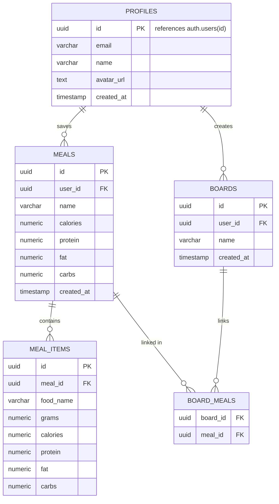

# Database ERD

This ERD is based on `db/schema.sql`.

## Relationship Summary

| Parent table | Child table   | Relationship                                                  |
| ------------ | ------------- | ------------------------------------------------------------- |
| `profiles`   | `meals`       | One user can save many meals.                                 |
| `profiles`   | `boards`      | One user can create many boards.                              |
| `meals`      | `meal_items`  | One meal contains many food items with their own macros.      |
| `boards`     | `board_meals` | One board links to many meals via a join table.               |
| `meals`      | `board_meals` | One meal can appear in the join table for one or more boards. |

Note: `profiles` is not a standalone user table — it extends Supabase's built-in `auth.users` table (same `id`, one-to-one), adding app-specific fields like name and avatar. Authentication itself (including Google OAuth) is handled entirely by Supabase Auth; `profiles` just stores the extra data your app needs about each authenticated user.

Note: a board's total calories/macros are **not stored** — they're computed at read-time by summing the macros of all meals linked to it via `board_meals`. This avoids stale totals if a meal is edited or removed from a board.
